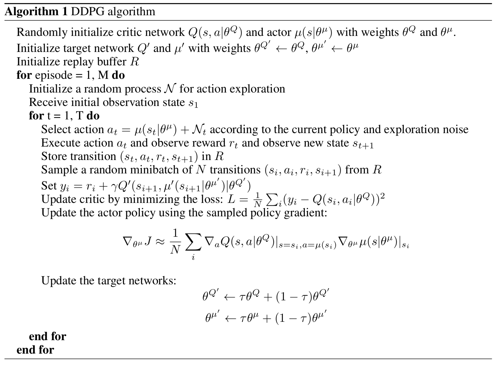
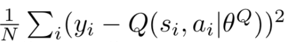
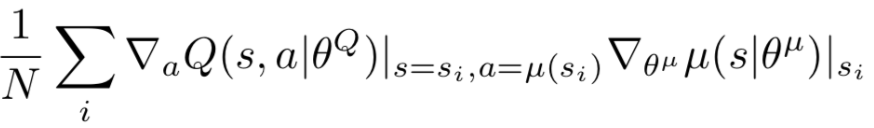

# Continuous-Control

Deep Reinforcement Learning Nanodegree Project 2

<p align="center">

</p>
  
### Project description

In this environment called Reacher, a double-jointed arm can move to target locations. A reward of +0.1 is provided for each step that the agent's hand is in the goal location. Thus, the goal the agent is to maintain its position at the target location for as many time steps as possible. Additional information can be found here: [link](https://github.com/Unity-Technologies/ml-agents/blob/master/docs/Learning-Environment-Examples.md#reacher)

The observation space consists of  Each action is a vector with four numbers, 

- **State space** is `33` dimensional continuous vector, consisting of position, rotation, velocity, and angular velocities of the arm.

- **Action space** is `4` dimentional continuous vector, corresponding to torque applicable to two joints. Every entry in the action vector should be a number between -1 and 1.

- **Solution criteria**: the environment is considered as solved when the agent gets an average score of **+30 over 100 consecutive episodes** (averaged over all agents in case of multiagent environment).

### Getting started

#### Configuration

PC configuration used for this project:
- OS: Mac OS 10.14 Mojave
- i7-8800H, 32GB, Radeon Pro 560X 4GB

#### Structure

All project files are stored in `/src` folder:
- `main.py` - main file where the program execution starts.
- `agent.py` - agent class implementation.
- `unity_env.py` - Unity Environment wrapper (borrowed from [here](https://github.com/Unity-Technologies/ml-agents/blob/master/gym-unity/gym_unity/envs/unity_env.py) and modified).
- `trainerDDPG.py` - trainer (interface between agent and environment) implementation. This particular interface is for DDPG agent. There is also one for PPO agent.
- `replay_buffer.py` - memory replay buffer implementation.
- `models.py` - neural network implementations (PyTorch)
- `uo_process.py` - Ornstein–Uhlenbeck process class implementation.

All project settings are stored in JSON file: `settings.json`. It is divided into 4 sections: 
- `general_params` - general, module agnostic parameters: mode (`train` or `test`), number of episodes, seed.
- `agent_params` - agent parameters: epsilon, gamma, learning rate, etc. This section also includes neural network configuration settings and memory replay buffer parameters.
- `trainer_params` - trainer parameters depending on the algorithm. They are responsible for any change of agent learning parameters. Agent can't change them.
- `env_params` - environment parameters: path, number of agents, etc.

#### Environment setup

- For detailed Python environment setup (PyTorch, the ML-Agents toolkit, and a few more Python packages) please follow these steps: [link](https://github.com/udacity/deep-reinforcement-learning#dependencies)

- Download pre-built Unity Environment:
  - [Linux - 20 agents](https://s3-us-west-1.amazonaws.com/udacity-drlnd/P2/Reacher/Reacher_Linux.zip), [Linux - 1 agent](https://s3-us-west-1.amazonaws.com/udacity-drlnd/P2/Reacher/one_agent/Reacher_Linux.zip)
  - [Mac - 20 agents](https://s3-us-west-1.amazonaws.com/udacity-drlnd/P2/Reacher/Reacher.app.zip), [Mac - 1 agent](https://s3-us-west-1.amazonaws.com/udacity-drlnd/P2/Reacher/one_agent/Reacher.app.zip)
  - [Win x32 - 20 agents](https://s3-us-west-1.amazonaws.com/udacity-drlnd/P2/Reacher/Reacher_Windows_x86.zip), [Win x32 - 1 agent](https://s3-us-west-1.amazonaws.com/udacity-drlnd/P2/Reacher/one_agent/Reacher_Windows_x86.zip)
  - [Win x64 - 20 agents](https://s3-us-west-1.amazonaws.com/udacity-drlnd/P2/Reacher/Reacher_Windows_x86_64.zip), [Win x64 - 1 agent](https://s3-us-west-1.amazonaws.com/udacity-drlnd/P2/Reacher/one_agent/Reacher_Windows_x86_64.zip)

 - Open `settings.json` and specify the relative path to the application file in `"path"` inside of `"env_params"`.

### Implementation details

#### DDPG

DDPG algorithm is summarised below:


**Idea (Summary)**. 

- Critic. Use neural network for Q-value function approximation as `state` -> `action` mapping with the following loss function minimised:


- Actor. Use neural network for determenistic policy approximation as `state` -> `argmax_Q` mapping with the following loss function minimised:


- Add a sample of the Ornstein–Uhlenbeck process ([link](https://en.wikipedia.org/wiki/Ornstein%E2%80%93Uhlenbeck_process)) for exploration.

Neural network architecture for actor:

| Layer   | (in, out)          | Activation|
|---------|--------------------|-----------|
| Layer 1 | (`state_size`, 128) | `relu`|
| Layer 2 | (128, 64) | `relu` |
| Layer 3 | (64, `action_size`)| `tanh` |

Neural network architecture for critic:

| Layer   | (in, out)          | Activation|
|---------|--------------------|-----------|
| Layer 1 | (`state_size`, 128) | `relu`|
| Layer 2 | (128, 256) | `relu` |
| Layer 3 | (256, 128)| `relu` |
| Layer 4 | (128, 32) | `relu` |
| Layer 5 | (32, 1)| - |

DDPG implementation can be found in `agent.py`:
```python
    def __update(self, experiences):

        states, actions, rewards, next_states, dones = experiences

        # update critic
        # ----------------------------------------------------------
        loss_fn = nn.MSELoss()
        self.__optimiser_critic.zero_grad()
        # form target
        next_actions = self.__actor_target(next_states)
        Q_target_next = self.__critic_target.forward(torch.cat((next_states, next_actions), dim=1)).detach()
        targets = rewards + self.gamma * Q_target_next * (1 - dones)
        # form output
        outputs = self.__critic_local.forward(torch.cat((states, actions), dim=1))
        mean_loss_critic = loss_fn(outputs, targets)  # minus added since it's gradient ascent
        mean_loss_critic.backward()
        self.__optimiser_critic.step()

        # update actor
        # ----------------------------------------------------------
        self.__optimiser_actor.zero_grad()
        predicted_actions = self.__actor_local(states)
        mean_loss_actor = - self.__critic_local.forward(torch.cat((states, predicted_actions), dim=1)).mean()
        mean_loss_actor.backward()
        self.__optimiser_actor.step()   # update actor

        self.__soft_update(self.__critic_local, self.__critic_target, self.tau)
        self.__soft_update(self.__actor_local, self.__actor_target, self.tau)
```

#### PPO 

_This section is under development_

The Proximal Policy Optimisation method is a good alternative to DDPG for this problem. It also shows much better results in continuous control tasks according to [benchmarks](https://arxiv.org/pdf/1604.06778.pdf).

**Idea (Summary)**

- Critic. Use neural network for value function approximation: `state` -> `value(state)`
- Actor. Use neural network for policy approximation, that represents value function: `state` -> `action`. However, the network outputs mean and standard deviation of the action, that is sampled from the Gaussian distribution afterwards. This enables exploration at the early stages of the agent training. 

Neural network architecture for actor:

| Layer   | (in, out)          | Activation|
|---------|--------------------|-----------|
| Layer 1 | (`state_size`, 128) | `relu`|
| Layer 2 | (128, 64) | `relu` |
| mean head | (64, `action_size`)| `tanh` |
| std head | (64, `action_size`)| -`relu` |

Neural network architecture for critic:

| Layer   | (in, out)          | Activation|
|---------|--------------------|-----------|
| Layer 1 | (`state_size`, 128) | `relu`|
| Layer 2 | (128, 256) | `relu` |
| Layer 3 | (256, 128)| `relu` |
| Layer 4 | (128, 32) | `relu` |
| Layer 5 | (32, 1)| - |

#### Result

- The following graph shows avegrage reward obtained by 20 agents during the first 200 episodes. As can be clearly observed, the reward remains stable around 38-39 for more than 100 episodes. 

- Log files of the training procedure can be found in `logs/run_2018-11-21_11-14.log`
- Actor and critic checkpoints are saved in `results/` folder.

### Possible improvements
